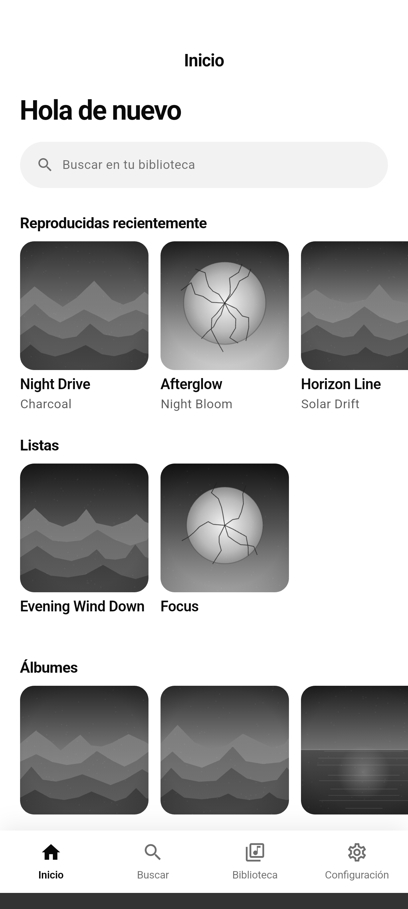
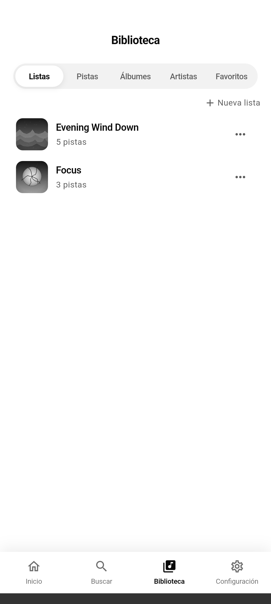
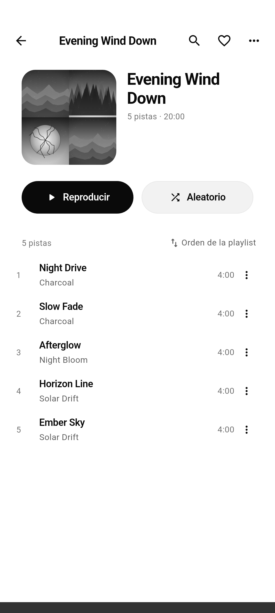
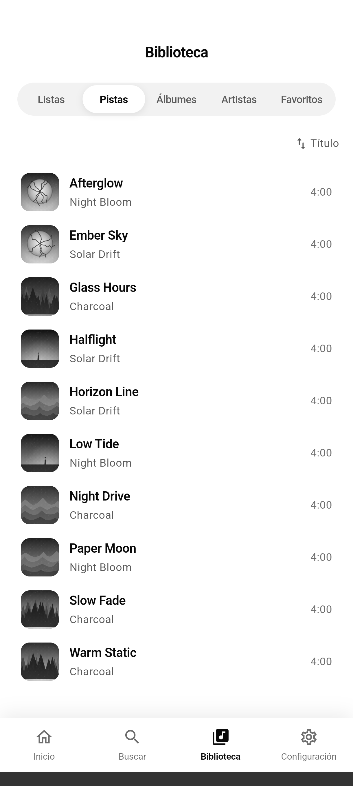
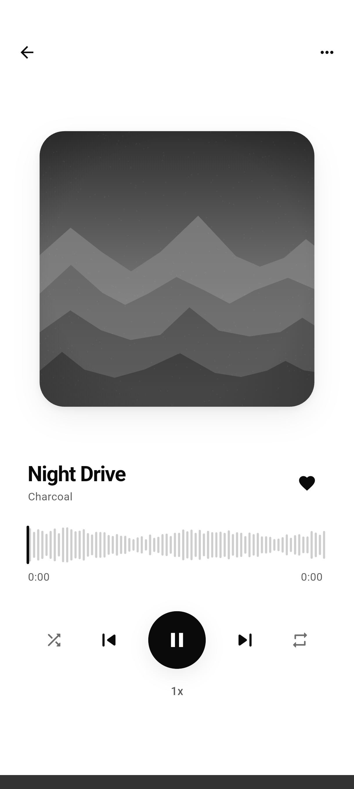
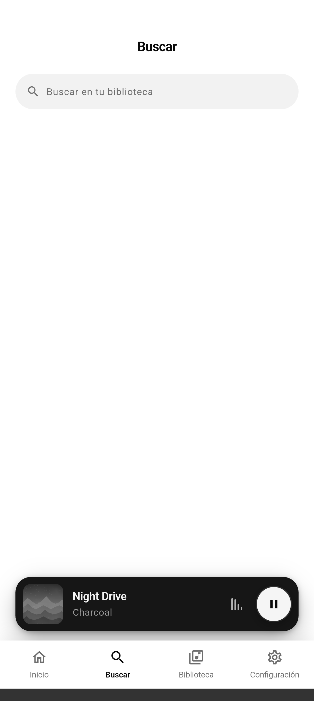
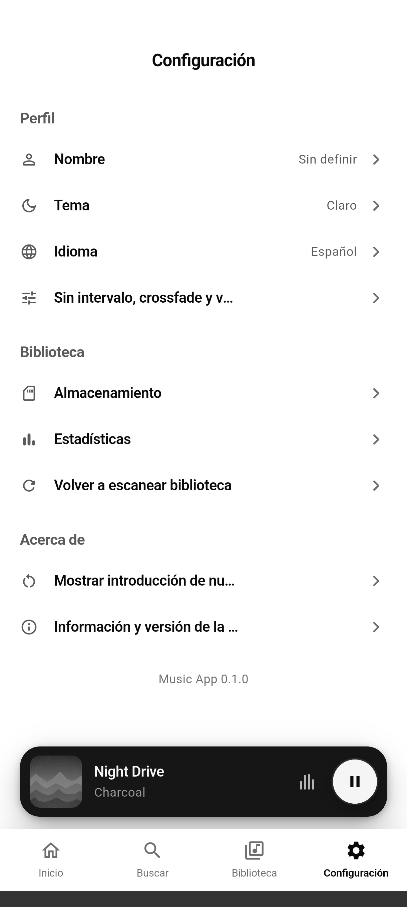
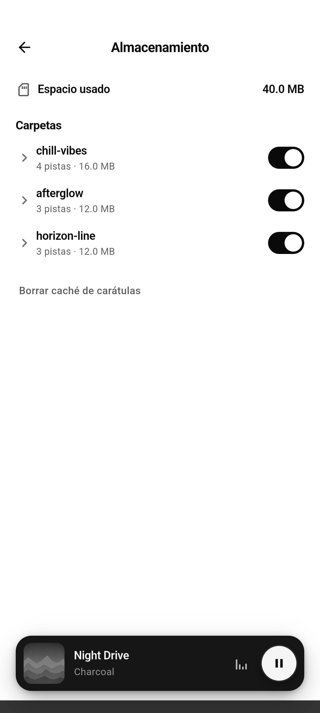
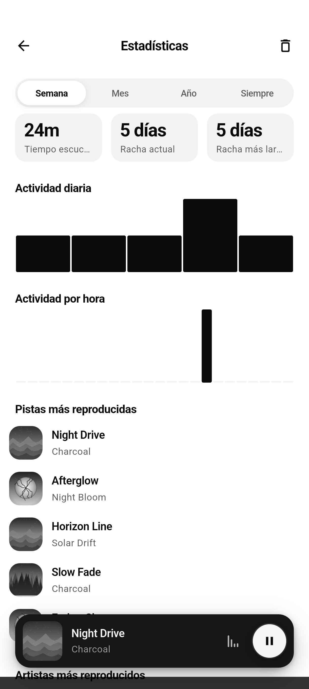

<br>
<div align="center">


</div>
<br>
<div align="center">
<a href="https://github.com/dariomatias-dev/music_app/actions/workflows/ci.yaml"></a>
<a href="https://codecov.io/gh/dariomatias-dev/music_app"></a>

<a href="LICENSE"></a>
</div>
<br>

<p align="center">
<a href="README.md">English</a> · <strong>Español</strong> · <a href="README.pt-BR.md">Português (BR)</a> · <a href="README.zh.md">中文</a>
</p>

<h1 align="center">Music App</h1>

<p align="center">
Una aplicación Android para reproducir la música que ya tienes en tu dispositivo, totalmente offline, sin cuentas, sin streaming.
<br>
<a href="#acerca-del-proyecto"><strong>Explora la documentación »</strong></a>
<br>
<br>
<a href="https://github.com/dariomatias-dev/music_app/issues">Reportar un Error</a>
·
<a href="https://github.com/dariomatias-dev/music_app/issues">Solicitar una Función</a>
</p>

## Tabla de Contenidos

- [Acerca Del Proyecto](#acerca-del-proyecto)
- [Características](#características)
- [Construido Con](#construido-con)
- [Arquitectura](#arquitectura)
- [Pruebas](#pruebas)
- [Capturas de Pantalla](#capturas-de-pantalla)
- [Primeros Pasos](#primeros-pasos)
- [Scripts](#scripts)
- [Documentación](#documentación)
- [Contribuir](#contribuir)
- [Licencia](#licencia)
- [Autor](#autor)

## Acerca Del Proyecto

**Music App** es un reproductor de música local y offline para Android. Escanea los archivos de audio que ya están en tu dispositivo, construye una biblioteca navegable a partir de ellos, y los reproduce sin conexión a internet, sin cuenta y sin ningún servicio de streaming de por medio.

El reproductor soporta reproducción sin pausas (gapless) y crossfade, una cola persistente, temporizador de suspensión, y velocidad de reproducción ajustable. Más allá de la reproducción, te da control real sobre tu biblioteca: playlists, favoritos, gestión de almacenamiento por carpeta (incluyendo cuáles carpetas se escanean), y estadísticas simples de escucha.

## Características

- **Biblioteca Local**: Escanea tu dispositivo en busca de archivos de audio e indexa pistas, álbumes y artistas, con carátulas y metadatos.
- **Reproducción**: Reproducción sin pausas (gapless), crossfade, aleatorio, repetición, velocidad ajustable y temporizador de suspensión.
- **Playlists**: Crea, renombra, duplica y elimina playlists, con descripción opcional, favoritos, reordenar arrastrando, búsqueda dentro de la playlist y múltiples criterios de ordenación.
- **Favoritos**: Marca cualquier pista como favorita para acceso rápido desde su propia pestaña.
- **Búsqueda**: Filtra tu biblioteca por título o artista mientras escribes.
- **Letras**: Ve la letra de una pista mientras suena, leída desde archivos locales o metadatos incrustados.
- **Gestión de Almacenamiento**: Ve el espacio usado por carpeta, incluye o excluye carpetas del escaneo, elimina archivos, limpia la caché de carátulas y olvida las pistas cuyos archivos ya no están.
- **Estadísticas**: Historial de escucha y tiempo dedicado, desglosado por pista y artista.
- **Tema Claro y Oscuro**: Temas en toda la app, siguiendo el sistema o elegido manualmente, con preferencia guardada.
- **Múltiples Idiomas**: Interfaz completa en inglés, español, portugués y chino.
- **Accesibilidad**: Etiquetas semánticas en elementos interactivos para lectores de pantalla.

## Construido Con

- **[Flutter](https://flutter.dev/)**: Kit de herramientas de UI de Google para construir aplicaciones nativas desde una única base de código.
- **[Dart](https://dart.dev/)**: El lenguaje de programación detrás de Flutter.
- **[Riverpod](https://riverpod.dev/)**: Gestión de estado e inyección de dependencias.
- **[go_router](https://pub.dev/packages/go_router)**: Enrutamiento declarativo, incluyendo un shell persistente de pestañas inferiores.
- **[just_audio](https://pub.dev/packages/just_audio)** y **[audio_service](https://pub.dev/packages/audio_service)**: Reproducción gapless/crossfade e integración con la sesión multimedia del sistema (pantalla de bloqueo, notificación, controles Bluetooth).
- **[drift](https://pub.dev/packages/drift)**: La base de datos SQLite local que respalda el índice de la biblioteca, las playlists, los favoritos y el historial de escucha.
- **[metadata_god](https://pub.dev/packages/metadata_god)** y **[on_audio_query](https://pub.dev/packages/on_audio_query)**: Lectura de metadatos de archivos de audio y consultas al almacén multimedia del dispositivo.
- **[freezed](https://pub.dev/packages/freezed_annotation)**: Modelos de dominio inmutables.
- **[intl](https://pub.dev/packages/intl)** y las herramientas de `l10n` nativas de Flutter: localización en inglés, español, portugués y chino.
- **[mocktail](https://pub.dev/packages/mocktail)**: Mocks en la suite de pruebas.

## Arquitectura

La app está organizada por feature (`lib/src/features/`), cada una con
sus propias capas `data`, `domain` y `presentation`, siguiendo Clean
Architecture y MVVM:

- **library**: las pistas, álbumes y artistas indexados, y sus pestañas.
- **player** / **queue**: los controles de reproducción, la pantalla de reproducción actual y la cola.
- **playlist**: las playlists creadas por el usuario y sus pistas.
- **history** / **statistics**: las reproducciones registradas y las estadísticas de escucha derivadas de ellas.
- **storage**: el uso de espacio por carpeta y la inclusión/exclusión del escaneo.
- **search**, **home**, **settings**, **onboarding**, **splash**: las demás pantallas de nivel superior.

El estado se gestiona con Riverpod (clases `ViewModel`/`Notifier`
expuestas mediante providers), el enrutamiento con `go_router`, y la
persistencia mediante `drift` (SQLite) y `shared_preferences`. El sistema
de diseño compartido, cada componente con tema, desde los botones hasta
el bottom sheet usado en toda la app, vive en su propio paquete local,
`packages/app_ui`; las responsabilidades transversales (enrutamiento,
base de datos, audio, permisos) están en `lib/src/core`. Las pantallas se
mantienen ligeras: cada una compone componentes ubicados en
`presentation/widgets/<nombre_de_pantalla>/` en lugar de definirlos inline.

## Pruebas

El proyecto tiene 188 archivos de prueba (131 en la app, 57 en
`packages/app_ui`), cubriendo repositorios, view models y widgets (40 de
ellos son pruebas golden, que renderizan 86 imágenes de referencia del
sistema de diseño y las pantallas principales), más las suites de
`integration_test/` que cubren onboarding, reproducción, persistencia,
listas de reproducción, favoritos, búsqueda, cambio de idioma y
copia de seguridad/restauración. La CI exige una cobertura de línea mínima del
97% en la app y del 98% en `packages/app_ui`, además del conjunto estricto
de lints `very_good_analysis` y `dart format`.

Cada ejecución de la CI sube su informe `lcov` a
[Codecov](https://codecov.io/gh/dariomatias-dev/music_app), que sigue los dos
paquetes como flags separados y comenta la diferencia de cobertura en cada pull
request. Para un informe línea a línea en local, genera uno del mismo archivo:

```sh
fvm flutter analyze
fvm flutter test --coverage
genhtml coverage/lcov.info -o coverage/html   # requiere lcov instalado
```

## Capturas de Pantalla

<div align="center">









</div>

## Primeros Pasos

El proyecto fija la versión del Flutter SDK mediante [FVM](https://fvm.app/), por lo que todos los comandos siguientes usan `fvm flutter` en lugar de un `flutter` instalado directamente.

```sh
git clone https://github.com/dariomatias-dev/music_app.git
cd music_app
fvm install
fvm flutter pub get
```

Luego ejecuta la app en un dispositivo o emulador conectado:

```sh
fvm flutter run
```

## Scripts

Los scripts utilitarios están en `scripts/`.

| Script           | Comando                                            | Descripción                                                                                                                                                                                                                                                                                                                                                                                                                         |
| ---------------- | -------------------------------------------------- | ----------------------------------------------------------------------------------------------------------------------------------------------------------------------------------------------------------------------------------------------------------------------------------------------------------------------------------------------------------------------------------------------------------------------------------- |
| `verify`         | `scripts/verify.sh [--all] [--gen] [--skip-tests]` | Ejecuta las mismas verificaciones que CI (formato, análisis, pruebas, cobertura), limitadas a los paquetes con cambios pendientes. `--all` verifica ambos de todos modos, `--gen` regenera código y localizaciones antes, `--skip-tests` lo restringe a formato y análisis. Guarda una marca al pasar, que el flujo de agente del repositorio lee para saber si el árbol de trabajo sigue correspondiendo a una ejecución aprobada. |
| `workspace_hash` | `scripts/workspace_hash.sh`                        | Imprime un hash de los archivos fuente que cubre el control de calidad. Lo usan `verify.sh` y el flujo de agente para detectar si el código cambió desde la última ejecución aprobada; rara vez se ejecuta a mano.                                                                                                                                                                                                                  |
| `screenshot`     | `scripts/screenshot.sh [device-id]`                | Recorre las pantallas principales de la app en un dispositivo o emulador conectado y guarda una captura de cada una en `screenshots/<locale>/`, una carpeta por idioma del README, usadas por cada uno de ellos. Ejecuta `fvm flutter devices` para listar los ids de dispositivos disponibles.                                                                                                                                                                                        |
| `check_coverage` | `scripts/check_coverage.sh <lcov-file> <minimum>`  | Falla si la cobertura de línea de un reporte `lcov.info` (generado con `flutter test --coverage`) cae por debajo de `<minimum>`. Se usa en CI para exigir los umbrales de arriba; ejecútalo localmente tras generar la cobertura para verificar antes de hacer push.                                                                                                                                                                |
| `check_l10n`     | `scripts/check_l10n.sh [arb-dir]`                  | Falla cuando los archivos ARB no coinciden en las claves que contienen. `gen-l10n` recurre a la plantilla ante una clave faltante sin avisar, así que un cambio traducido a medias llegaría al usuario como texto en inglés dentro de una compilación en español. Lo ejecutan `verify.sh` y CI. |

## Documentación

Documentación técnica más profunda vive en [`docs/`](docs/architecture.es.md), disponible en todos los idiomas que soporta la app:

- **[Arquitectura](docs/architecture.es.md)**: capas, gestión de estado, navegación, persistencia y el sistema de diseño, con más profundidad que la visión general de arriba.
- **[Notas de Dependencias](docs/dependencies.es.md)**: por qué algunos paquetes quedan topados por debajo de su última versión.
- **[Guía de Contribución](docs/contributing.es.md)**: configuración, convenciones y el checklist del pull request.
- **[Código de Conducta](docs/code_of_conduct.es.md)**.
- **[Política de Seguridad](docs/security.es.md)**: cómo reportar una vulnerabilidad.

## Contribuir

Las contribuciones hacen que la comunidad de código abierto sea un lugar increíble para aprender y crear. Cualquier contribución que hagas será muy apreciada.

Abre un issue para discutir un cambio antes de empezar a trabajar en él, sigue el estilo de código existente, y asegúrate de que `fvm flutter analyze` y `fvm flutter test` pasen antes de abrir un pull request. Consulta la [Guía de Contribución](docs/contributing.es.md) completa para más detalles.

## Licencia

Distribuido bajo la **Licencia MIT**. Consulta el archivo [LICENSE](LICENSE) para más información.

## Autor

Desarrollado por **Dário Matias Sales**:

- **Portafolio**: [dariomatias-dev](https://dariomatias-dev.com)
- **GitHub**: [dariomatias-dev](https://github.com/dariomatias-dev)
- **Email**: [dariomatias.dev@gmail.com](mailto:dariomatias.dev@gmail.com)
- **Instagram**: [@dariomatias_dev](https://instagram.com/dariomatias_dev)
- **LinkedIn**: [linkedin.com/in/dariomatias-dev](https://linkedin.com/in/dariomatias-dev)
