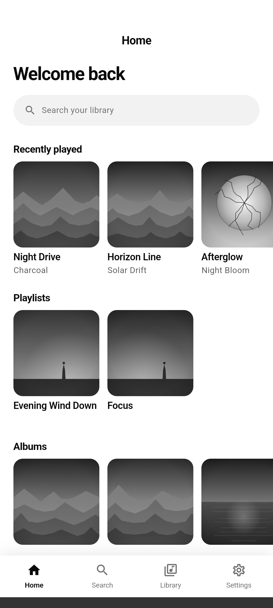
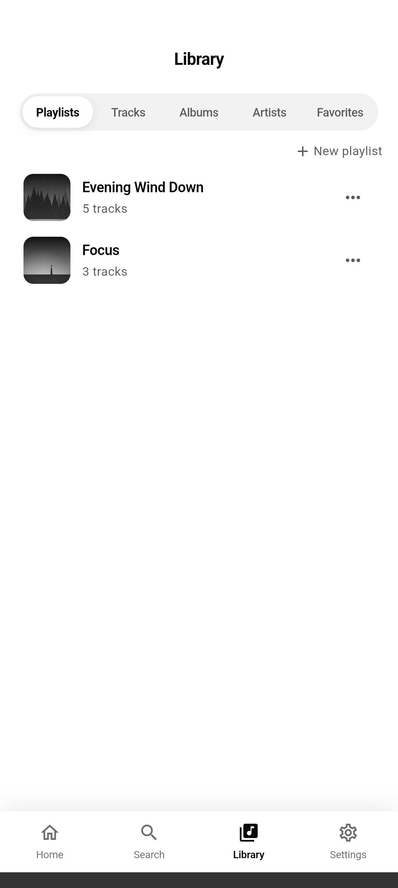
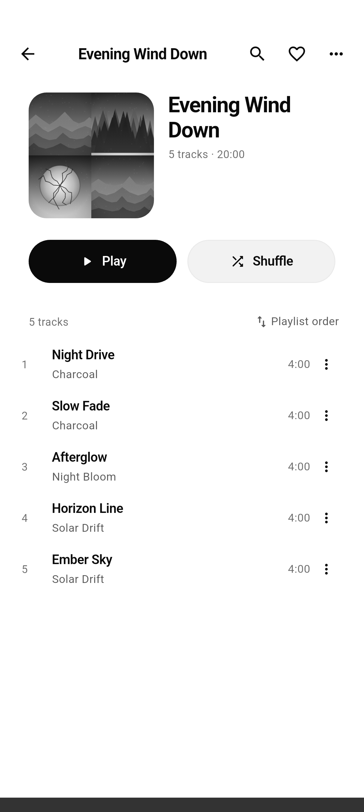
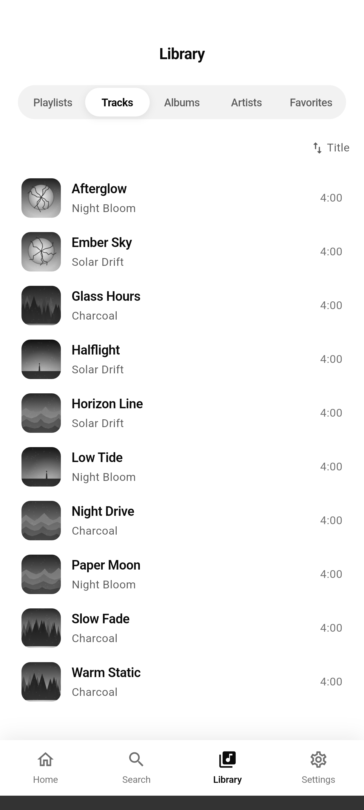
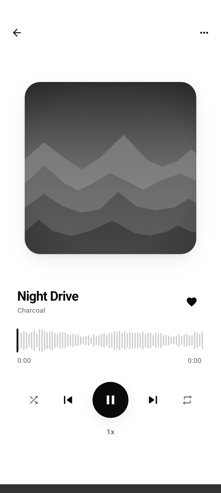
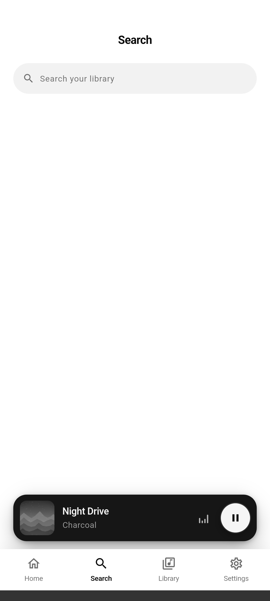
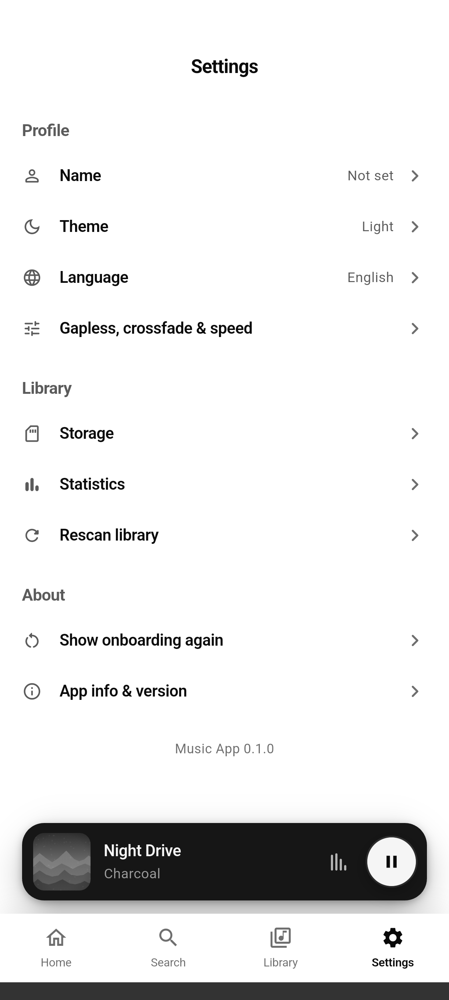
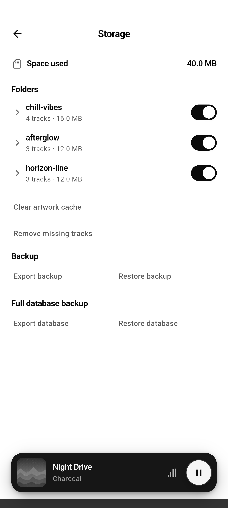
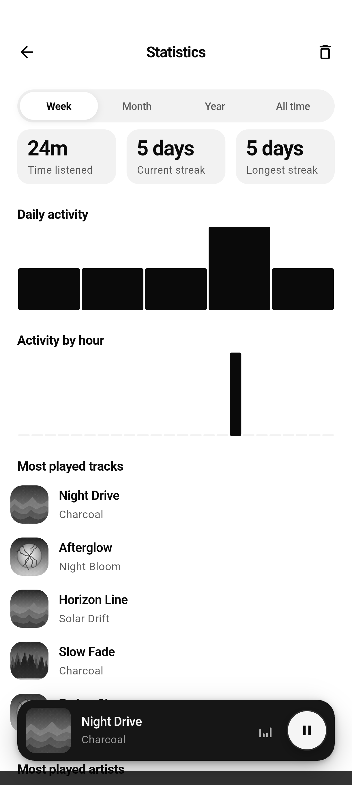

<br>
<div align="center">


</div>
<br>
<div align="center">
<a href="https://github.com/dariomatias-dev/music_app/actions/workflows/ci.yaml"></a>
<a href="https://codecov.io/gh/dariomatias-dev/music_app"></a>

<a href="LICENSE"></a>
</div>
<br>

<p align="center">
<strong>English</strong> · <a href="README.es.md">Español</a> · <a href="README.pt-BR.md">Português (BR)</a> · <a href="README.zh.md">中文</a>
</p>

<h1 align="center">Music App</h1>

<p align="center">
An Android app for playing the music already on your device, fully offline, no accounts, no streaming.
<br>
<a href="#about-the-project"><strong>Explore the docs »</strong></a>
<br>
<br>
<a href="https://github.com/dariomatias-dev/music_app/issues">Report Bug</a>
·
<a href="https://github.com/dariomatias-dev/music_app/issues">Request Feature</a>
</p>

## Table of Contents

- [About The Project](#about-the-project)
- [Features](#features)
- [Built With](#built-with)
- [Architecture](#architecture)
- [Testing](#testing)
- [Screenshots](#screenshots)
- [Getting Started](#getting-started)
- [Scripts](#scripts)
- [Documentation](#documentation)
- [Contributing](#contributing)
- [License](#license)
- [Author](#author)

## About The Project

**Music App** is an offline local music player for Android. It scans the audio files already on your device, builds a searchable library out of them, and plays it all back with no network connection, no account, and no streaming service involved.

The player supports gapless playback and crossfade, a persistent queue, a sleep timer, and adjustable playback speed. Beyond playback, it gives you real control over your library: playlists, favorites, per-folder storage management (including which folders get scanned at all), and simple listening statistics.

## Features

- **Local Library**: Scans your device for audio files and indexes tracks, albums, and artists, with cover art and metadata.
- **Playback**: Gapless playback, crossfade, shuffle, repeat, adjustable speed, and a sleep timer.
- **Playlists**: Create, rename, duplicate, and delete playlists, with an optional description, favoriting, drag-to-reorder, search within a playlist, and multiple sort orders.
- **Favorites**: Favorite any track for quick access from its own tab.
- **Search**: Filter your library by title or artist as you type.
- **Lyrics**: View a track's lyrics alongside playback, read from local files or embedded metadata.
- **Storage Management**: See space used per folder, include or exclude folders from scanning, delete files, and clear the cached artwork.
- **Statistics**: Listening history and time spent, broken down by track and artist.
- **Light & Dark Theme**: App-wide theming, following the system or set manually, with a persisted preference.
- **Multiple Languages**: Full app UI in English, Spanish, Portuguese, and Chinese.
- **Accessibility**: Semantic labels on interactive elements for screen readers.

## Built With

- **[Flutter](https://flutter.dev/)**: Google's UI toolkit for building natively compiled applications from a single codebase.
- **[Dart](https://dart.dev/)**: The programming language behind Flutter.
- **[Riverpod](https://riverpod.dev/)**: State management and dependency injection.
- **[go_router](https://pub.dev/packages/go_router)**: Declarative routing, including a persistent bottom-tab shell.
- **[just_audio](https://pub.dev/packages/just_audio)** and **[audio_service](https://pub.dev/packages/audio_service)**: Gapless/crossfade playback and OS-level media session integration (lock screen, notification, Bluetooth controls).
- **[drift](https://pub.dev/packages/drift)**: The local SQLite database backing the library index, playlists, favorites, and listening history.
- **[metadata_god](https://pub.dev/packages/metadata_god)** and **[on_audio_query](https://pub.dev/packages/on_audio_query)**: Reading audio file metadata and querying the device's media store.
- **[freezed](https://pub.dev/packages/freezed_annotation)**: Immutable domain models.
- **[intl](https://pub.dev/packages/intl)** and Flutter's built-in `l10n` tooling: English, Spanish, Portuguese, and Chinese localization.
- **[mocktail](https://pub.dev/packages/mocktail)**: Mocking in the test suite.

## Architecture

The app is organized by feature (`lib/src/features/`), each with its own
`data`, `domain`, and `presentation` layers, following Clean Architecture
and MVVM:

- **library**: the indexed tracks, albums, and artists, and their tabs.
- **player** / **queue**: playback controls, the now-playing screen, and the queue.
- **playlist**: user-created playlists and their tracks.
- **history** / **statistics**: recorded plays and the listening stats derived from them.
- **storage**: per-folder space usage and scan inclusion/exclusion.
- **search**, **home**, **settings**, **onboarding**, **splash**: the remaining top-level screens.

State is managed with Riverpod (`ViewModel`/`Notifier` classes exposed
through providers), routing with `go_router`, and persistence through
`drift` (SQLite) and `shared_preferences`. The shared design system,
every themed component from buttons to the bottom sheet used across the
app, lives in its own local package, `packages/app_ui`; cross-cutting
concerns (navigation, the database, audio, permissions) live under
`lib/src/core`. Screens stay thin: each one composes components kept in
`presentation/widgets/<screen_name>/` rather than defining them inline.

## Testing

The project has 185 test files (128 in the app, 57 in `packages/app_ui`)
covering repositories, view models, and widgets — 40 of them golden tests,
rendering 86 reference images across the design system and key screens —
plus `integration_test/` suites covering onboarding, playback, persistence,
playlists, favorites, search, language switching, and backup/restore. CI
enforces a minimum line coverage of 97% for the app
and 98% for `packages/app_ui`, alongside the strict `very_good_analysis`
lint set and `dart format`.

Every CI run uploads its `lcov` report to
[Codecov](https://codecov.io/gh/dariomatias-dev/music_app), which tracks the two
packages as separate flags and comments the coverage delta on each pull request.
For a line-by-line report locally, generate one from the same file:

```sh
fvm flutter analyze
fvm flutter test --coverage
genhtml coverage/lcov.info -o coverage/html   # needs lcov installed
```

## Screenshots

<div align="center">









</div>

## Getting Started

The project pins its Flutter SDK version via [FVM](https://fvm.app/), so all commands below use `fvm flutter` rather than a bare `flutter` install.

```sh
git clone https://github.com/dariomatias-dev/music_app.git
cd music_app
fvm install
fvm flutter pub get
```

Then run the app on a connected device or emulator:

```sh
fvm flutter run
```

## Scripts

Utility scripts live under `scripts/`.

| Script           | Command                                            | Description                                                                                                                                                                                                                                                                                                                                                                                    |
| ---------------- | -------------------------------------------------- | ---------------------------------------------------------------------------------------------------------------------------------------------------------------------------------------------------------------------------------------------------------------------------------------------------------------------------------------------------------------------------------------------- |
| `verify`         | `scripts/verify.sh [--all] [--gen] [--skip-tests]` | Runs the same checks CI does (formatting, analysis, tests, coverage), scoped to the packages with pending changes. `--all` checks both regardless, `--gen` regenerates code and localizations first, `--skip-tests` limits the run to formatting and analysis. Records a stamp on success, which the repo's agent workflow reads to tell whether the working tree still matches a passing run. |
| `workspace_hash` | `scripts/workspace_hash.sh`                        | Prints a hash of the source files the quality gate covers. Used by `verify.sh` and by the agent workflow to detect whether code changed since the last passing run; rarely run by hand.                                                                                                                                                                                                        |
| `screenshot`     | `scripts/screenshot.sh [device-id]`                | Drives the app through its main screens on a connected device or emulator and saves a screenshot of each one into `screenshots/`, used in the README. Run `fvm flutter devices` to list available device ids.                                                                                                                                                                                  |
| `check_coverage` | `scripts/check_coverage.sh <lcov-file> <minimum>`  | Fails if line coverage in an `lcov.info` report (from `flutter test --coverage`) falls below `<minimum>`. Used in CI to enforce the thresholds above; run it locally after generating coverage to check before pushing.                                                                                                                                                                        |

## Documentation

Deeper technical docs live under [`docs/`](docs/architecture.md), each available in every language the app supports:

- **[Architecture](docs/architecture.md)**: layering, state management, navigation, persistence, and the design system, in more depth than the overview above.
- **[Dependency Notes](docs/dependencies.md)**: why a few packages are pinned below their latest version.
- **[Contributing Guide](docs/contributing.md)**: setup, conventions, and the pull request checklist.
- **[Code of Conduct](docs/code_of_conduct.md)**.
- **[Security Policy](docs/security.md)**: how to report a vulnerability.

## Contributing

Contributions make the open-source community an amazing place to learn and create. Any contributions you make are greatly appreciated.

Open an issue to discuss a change before starting on it, follow the existing code style, and make sure `fvm flutter analyze` and `fvm flutter test` pass before opening a pull request. See the full [Contributing Guide](docs/contributing.md) for details.

## License

Distributed under the **MIT License**. See the [LICENSE](LICENSE) file for more information.

## Author

Developed by **Dário Matias Sales**:

- **Portfolio**: [dariomatias-dev](https://dariomatias-dev.com)
- **GitHub**: [dariomatias-dev](https://github.com/dariomatias-dev)
- **Email**: [dariomatias.dev@gmail.com](mailto:dariomatias.dev@gmail.com)
- **Instagram**: [@dariomatias_dev](https://instagram.com/dariomatias_dev)
- **LinkedIn**: [linkedin.com/in/dariomatias-dev](https://linkedin.com/in/dariomatias-dev)
