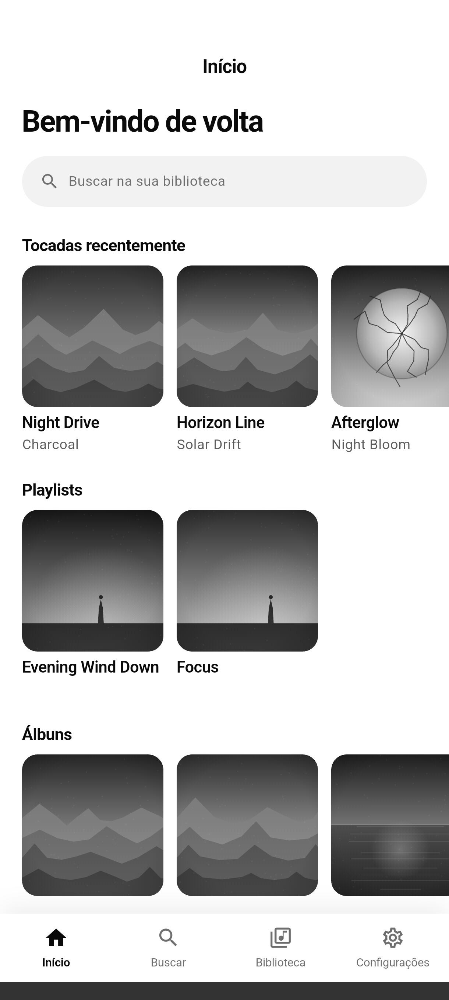
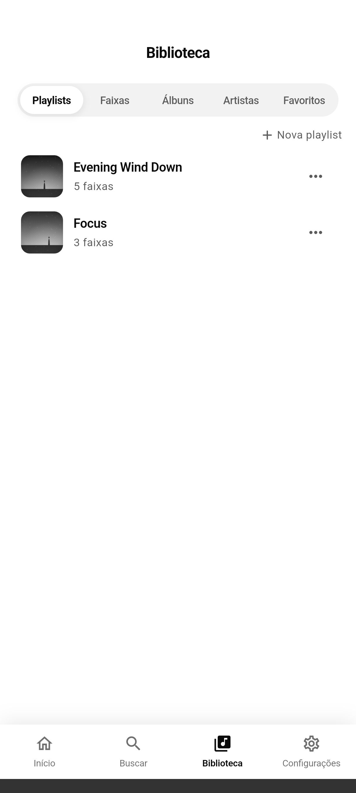
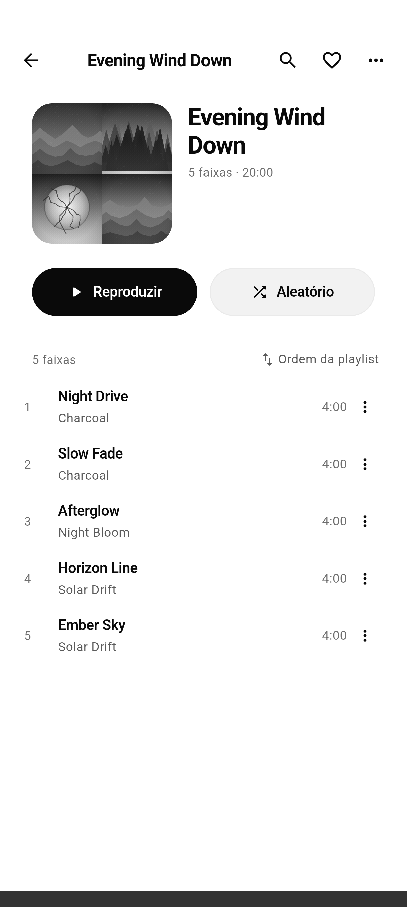
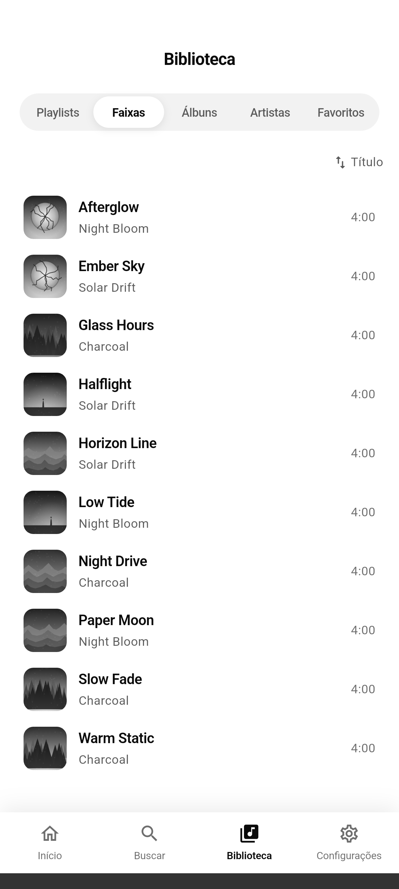
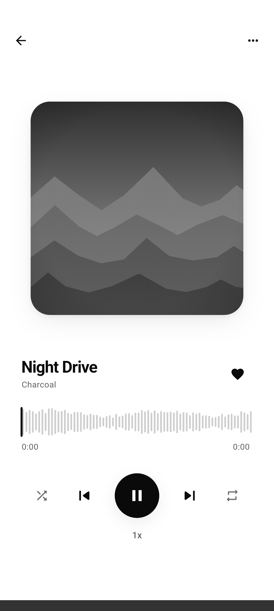
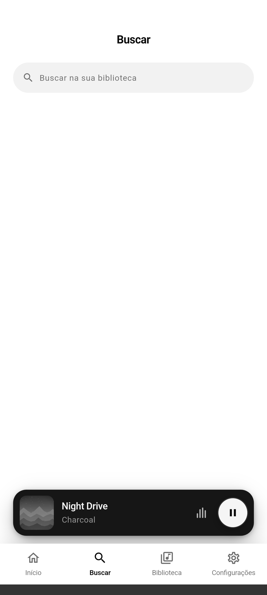
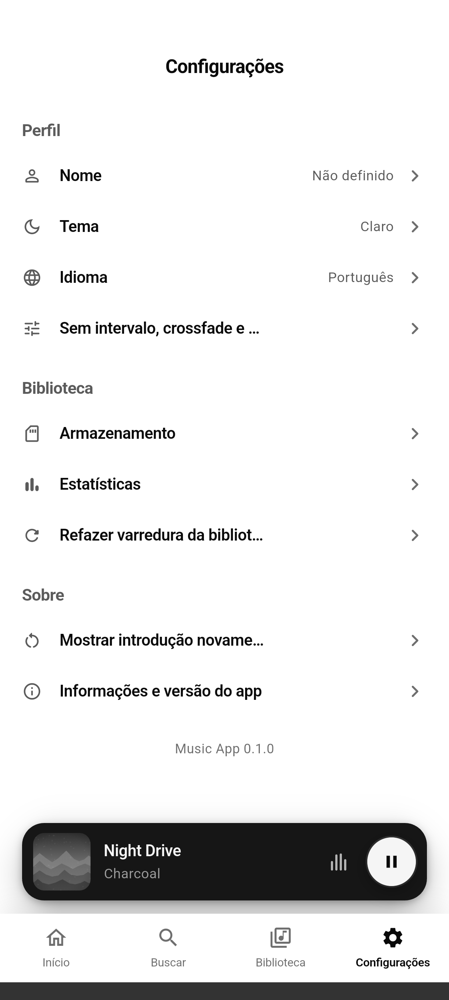
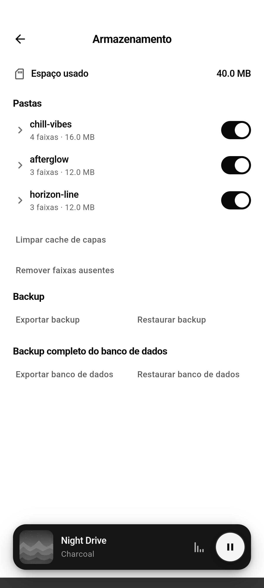
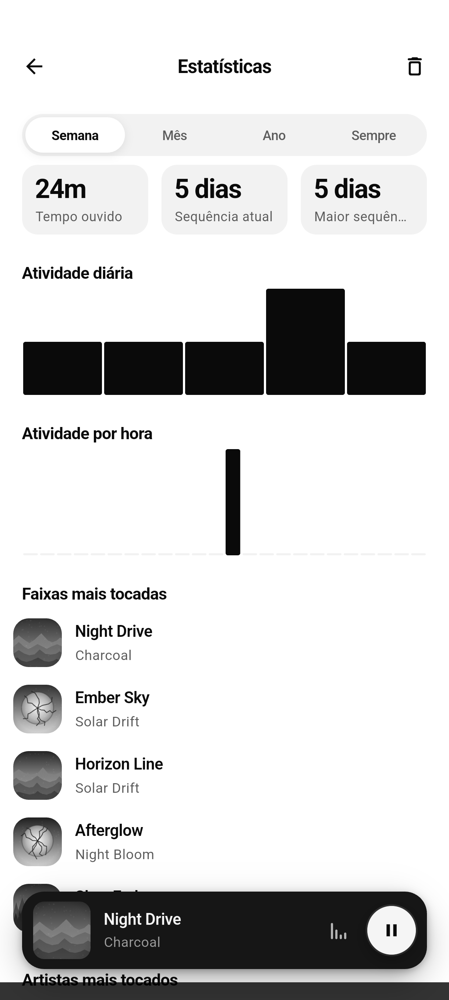

<br>
<div align="center">


</div>
<br>
<div align="center">
<a href="https://github.com/dariomatias-dev/music_app/actions/workflows/ci.yaml"></a>
<a href="https://codecov.io/gh/dariomatias-dev/music_app"></a>

<a href="LICENSE"></a>
</div>
<br>

<p align="center">
<a href="README.md">English</a> · <a href="README.es.md">Español</a> · <strong>Português (BR)</strong> · <a href="README.zh.md">中文</a>
</p>

<h1 align="center">Music App</h1>

<p align="center">
Um aplicativo Android para tocar a música que já está no seu dispositivo, totalmente offline, sem contas, sem streaming.
<br>
<a href="#sobre-o-projeto"><strong>Explore a documentação »</strong></a>
<br>
<br>
<a href="https://github.com/dariomatias-dev/music_app/issues">Reportar Bug</a>
·
<a href="https://github.com/dariomatias-dev/music_app/issues">Solicitar Funcionalidade</a>
</p>

## Sumário

- [Sobre O Projeto](#sobre-o-projeto)
- [Funcionalidades](#funcionalidades)
- [Construído Com](#construído-com)
- [Arquitetura](#arquitetura)
- [Testes](#testes)
- [Capturas de Tela](#capturas-de-tela)
- [Começando](#começando)
- [Scripts](#scripts)
- [Documentação](#documentação)
- [Contribuindo](#contribuindo)
- [Licença](#licença)
- [Autor](#autor)

## Sobre O Projeto

**Music App** é um player de música local e offline para Android. Ele escaneia os arquivos de áudio que já estão no seu dispositivo, monta uma biblioteca navegável a partir deles, e toca tudo sem conexão com a internet, sem conta e sem nenhum serviço de streaming envolvido.

O player suporta reprodução sem pausas (gapless) e crossfade, uma fila persistente, temporizador de suspensão, e velocidade de reprodução ajustável. Além da reprodução, ele te dá controle real sobre sua biblioteca: playlists, favoritos, gerenciamento de armazenamento por pasta (incluindo quais pastas são escaneadas), e estatísticas simples de audição.

## Funcionalidades

- **Biblioteca Local**: Escaneia seu dispositivo em busca de arquivos de áudio e indexa faixas, álbuns e artistas, com capas e metadados.
- **Reprodução**: Reprodução sem pausas (gapless), crossfade, aleatório, repetição, velocidade ajustável e temporizador de suspensão.
- **Playlists**: Crie, renomeie, duplique e exclua playlists, com descrição opcional, favoritar, reordenar arrastando, busca dentro da playlist e múltiplos critérios de ordenação.
- **Favoritos**: Favorite qualquer faixa para acesso rápido na sua própria aba.
- **Busca**: Filtre sua biblioteca por título ou artista enquanto digita.
- **Letras**: Veja a letra de uma faixa junto com a reprodução, lida de arquivos locais ou de metadados embutidos.
- **Gerenciamento de Armazenamento**: Veja o espaço usado por pasta, inclua ou exclua pastas do escaneamento, exclua arquivos, limpe o cache de capas e esqueça as faixas cujos arquivos não estão mais lá.
- **Estatísticas**: Histórico de audição e tempo gasto, detalhado por faixa e artista.
- **Tema Claro e Escuro**: Temas em todo o app, seguindo o sistema ou escolhido manualmente, com preferência salva.
- **Múltiplos Idiomas**: Interface completa em inglês, espanhol, português e chinês.
- **Acessibilidade**: Labels semânticos em elementos interativos para leitores de tela.

## Construído Com

- **[Flutter](https://flutter.dev/)**: Kit de ferramentas de UI do Google para construir aplicações nativas a partir de uma única base de código.
- **[Dart](https://dart.dev/)**: A linguagem de programação por trás do Flutter.
- **[Riverpod](https://riverpod.dev/)**: Gerenciamento de estado e injeção de dependência.
- **[go_router](https://pub.dev/packages/go_router)**: Roteamento declarativo, incluindo um shell persistente de abas inferiores.
- **[just_audio](https://pub.dev/packages/just_audio)** e **[audio_service](https://pub.dev/packages/audio_service)**: Reprodução gapless/crossfade e integração com a sessão de mídia do sistema (tela de bloqueio, notificação, controles Bluetooth).
- **[drift](https://pub.dev/packages/drift)**: O banco de dados SQLite local por trás do índice da biblioteca, das playlists, dos favoritos e do histórico de audição.
- **[metadata_god](https://pub.dev/packages/metadata_god)** e **[on_audio_query](https://pub.dev/packages/on_audio_query)**: Leitura de metadados de arquivos de áudio e consultas ao repositório de mídia do dispositivo.
- **[freezed](https://pub.dev/packages/freezed_annotation)**: Modelos de domínio imutáveis.
- **[intl](https://pub.dev/packages/intl)** e o suporte nativo de `l10n` do Flutter: localização em inglês, espanhol, português e chinês.
- **[mocktail](https://pub.dev/packages/mocktail)**: Mocks na suíte de testes.

## Arquitetura

O app é organizado por feature (`lib/src/features/`), cada uma com suas
próprias camadas `data`, `domain` e `presentation`, seguindo Clean
Architecture e MVVM:

- **library**: as faixas, álbuns e artistas indexados, e suas abas.
- **player** / **queue**: os controles de reprodução, a tela de reprodução atual e a fila.
- **playlist**: as playlists criadas pelo usuário e suas faixas.
- **history** / **statistics**: as reproduções registradas e as estatísticas de audição derivadas delas.
- **storage**: o uso de espaço por pasta e a inclusão/exclusão do escaneamento.
- **search**, **home**, **settings**, **onboarding**, **splash**: as demais telas de nível superior.

O estado é gerenciado com Riverpod (classes `ViewModel`/`Notifier`
expostas via providers), o roteamento com `go_router`, e a persistência
por `drift` (SQLite) e `shared_preferences`. O design system
compartilhado, cada componente com tema, dos botões ao bottom sheet
usado em todo o app, vive em seu próprio pacote local,
`packages/app_ui`; responsabilidades transversais (navegação, banco de
dados, áudio, permissões) ficam em `lib/src/core`. As telas são enxutas:
cada uma compõe componentes mantidos em
`presentation/widgets/<nome_da_tela>/`, em vez de defini-los inline.

## Testes

O projeto tem 186 arquivos de teste (129 no app, 57 em
`packages/app_ui`), cobrindo repositórios, view models e widgets (40
deles são testes golden, que renderizam 86 imagens de referência do design
system e das telas principais), além das suítes em `integration_test/`
cobrindo onboarding, reprodução, persistência, playlists, favoritos, busca,
troca de idioma e backup/restauração. O CI exige cobertura mínima de linha de 97% no app e 98% em
`packages/app_ui`, junto do conjunto rigoroso de lints
`very_good_analysis` e `dart format`.

Cada execução do CI envia seu relatório `lcov` para o
[Codecov](https://codecov.io/gh/dariomatias-dev/music_app), que acompanha os dois
pacotes como flags separadas e comenta a variação de cobertura em cada pull
request. Para um relatório linha a linha localmente, gere um a partir do mesmo
arquivo:

```sh
fvm flutter analyze
fvm flutter test --coverage
genhtml coverage/lcov.info -o coverage/html   # requer o lcov instalado
```

## Capturas de Tela

<div align="center">









</div>

## Começando

O projeto fixa a versão do Flutter SDK via [FVM](https://fvm.app/), por isso todos os comandos abaixo usam `fvm flutter` em vez de um `flutter` instalado direto.

```sh
git clone https://github.com/dariomatias-dev/music_app.git
cd music_app
fvm install
fvm flutter pub get
```

Depois execute o app em um dispositivo ou emulador conectado:

```sh
fvm flutter run
```

## Scripts

Scripts utilitários ficam em `scripts/`.

| Script           | Comando                                            | Descrição                                                                                                                                                                                                                                                                                                                                                                                                                                    |
| ---------------- | -------------------------------------------------- | -------------------------------------------------------------------------------------------------------------------------------------------------------------------------------------------------------------------------------------------------------------------------------------------------------------------------------------------------------------------------------------------------------------------------------------------- |
| `verify`         | `scripts/verify.sh [--all] [--gen] [--skip-tests]` | Executa as mesmas verificações do CI (formatação, análise, testes, cobertura), limitadas aos pacotes com mudanças pendentes. `--all` verifica os dois de qualquer forma, `--gen` regenera código e localizações antes, `--skip-tests` restringe a execução a formatação e análise. Grava um marcador em caso de sucesso, lido pelo fluxo de agente do repositório para saber se a árvore de trabalho ainda corresponde a uma execução aprovada. |
| `workspace_hash` | `scripts/workspace_hash.sh`                        | Imprime um hash dos arquivos-fonte cobertos pelo portão de qualidade. Usado por `verify.sh` e pelo fluxo de agente para detectar se o código mudou desde a última execução aprovada; raramente rodado à mão.                                                                                                                                                                                                                                 |
| `screenshot`     | `scripts/screenshot.sh [device-id]`                | Percorre as principais telas do app em um dispositivo ou emulador conectado e salva uma captura de cada uma em `screenshots/<locale>/`, uma pasta por idioma do README, usadas por cada um deles. Execute `fvm flutter devices` para listar os ids de dispositivos disponíveis.                                                                                                                                                                                                                  |
| `check_coverage` | `scripts/check_coverage.sh <lcov-file> <minimum>`  | Falha se a cobertura de linha de um relatório `lcov.info` (gerado com `flutter test --coverage`) ficar abaixo de `<minimum>`. Usado no CI para impor os limites acima; execute localmente após gerar a cobertura para checar antes do push.                                                                                                                                                                                                 |
| `check_l10n`     | `scripts/check_l10n.sh [arb-dir]`                  | Falha quando os arquivos ARB divergem nas chaves que carregam. O `gen-l10n` recorre ao template diante de uma chave faltando sem avisar nada, então uma mudança traduzida pela metade chegaria ao usuário como texto em inglês dentro de um build em português. Executado pelo `verify.sh` e pelo CI. |

## Documentação

Documentação técnica mais aprofundada mora em [`docs/`](docs/architecture.pt-BR.md), disponível em todo idioma que o app suporta:

- **[Arquitetura](docs/architecture.pt-BR.md)**: camadas, gerenciamento de estado, navegação, persistência e o design system, com mais profundidade que a visão geral acima.
- **[Notas de Dependências](docs/dependencies.pt-BR.md)**: por que alguns pacotes ficam travados abaixo da última versão.
- **[Guia de Contribuição](docs/contributing.pt-BR.md)**: configuração, convenções e o checklist do pull request.
- **[Código de Conduta](docs/code_of_conduct.pt-BR.md)**.
- **[Política de Segurança](docs/security.pt-BR.md)**: como reportar uma vulnerabilidade.

## Contribuindo

Contribuições tornam a comunidade open-source um lugar incrível para aprender e criar. Qualquer contribuição que você fizer será muito bem-vinda.

Abra uma issue para discutir uma mudança antes de começar a trabalhar nela, siga o estilo de código existente, e garanta que `fvm flutter analyze` e `fvm flutter test` passem antes de abrir um pull request. Veja o [Guia de Contribuição](docs/contributing.pt-BR.md) completo para mais detalhes.

## Licença

Distribuído sob a **Licença MIT**. Veja o arquivo [LICENSE](LICENSE) para mais informações.

## Autor

Desenvolvido por **Dário Matias Sales**:

- **Portfólio**: [dariomatias-dev](https://dariomatias-dev.com)
- **GitHub**: [dariomatias-dev](https://github.com/dariomatias-dev)
- **Email**: [dariomatias.dev@gmail.com](mailto:dariomatias.dev@gmail.com)
- **Instagram**: [@dariomatias_dev](https://instagram.com/dariomatias_dev)
- **LinkedIn**: [linkedin.com/in/dariomatias-dev](https://linkedin.com/in/dariomatias-dev)
